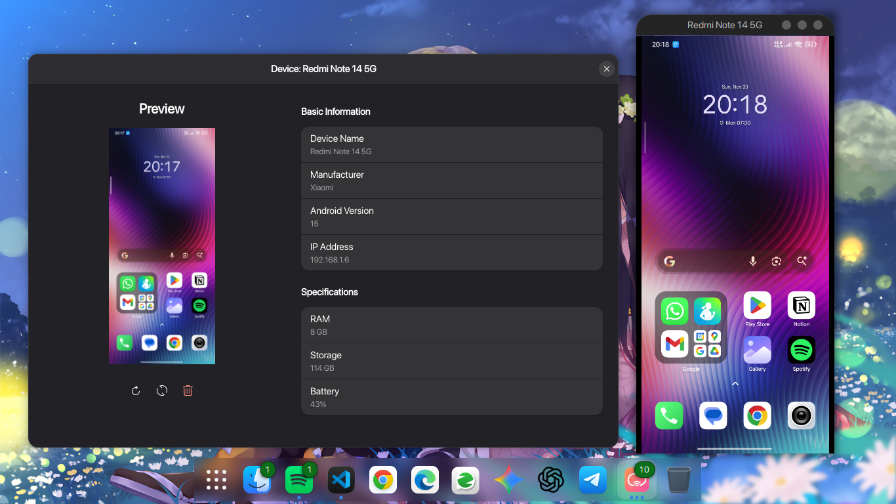
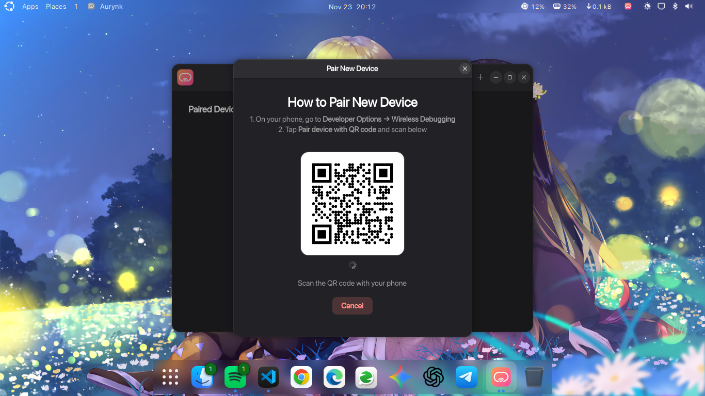
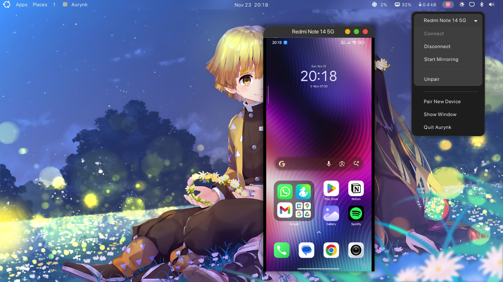

# 🚀 Aurynk - Your Android Device Manager for Linux

<p align="center">
  
</p>

<p align="center">
  <strong>Wirelessly connect, manage and control your Android devices from Linux</strong>
</p>

<p align="center">
  <a href="#-installation">📦 Install</a> •
  <a href="#-quick-start">🚀 Quick Start</a> •
  <a href="#-features">✨ Features</a> •
  <a href="#-troubleshooting">🔧 Help</a>
</p>

---

## 🎯 What is Aurynk?

Aurynk (Aura + Sync, pronounced “aw-rink”) makes managing your Android devices from Linux **simple and wireless**. No more cables, no more complicated setup - just scan a QR code and you're connected!

Perfect for:
- 📱 **Developers** testing apps on multiple devices
- 🎮 **Gamers** managing Android gaming setups  
- 👨‍💻 **Power users** who want full device control
- 📸 **Content creators** capturing device screenshots

## ✨ Features

| Feature | Description |
|---------|-------------|
| 🔗 **Wireless Pairing** | Connect via QR code - no cables needed! |
| 📱 **Device Management** | View detailed specs, battery, storage info |
| 📸 **Screenshot Capture** | Instantly capture and save device screenshots |
| 🖥️ **Screen Mirroring** | View and control your device screen (via scrcpy) |
| 🎨 **Modern Interface** | Beautiful GTK4 design that fits your Linux desktop |
| � **Multiple Devices** | Manage several Android devices simultaneously |

## 📦 Installation

### Option 1: Flatpak (Recommended) 🌟

Aurynk is available on [Flathub](https://flathub.org/en/apps/io.github.IshuSinghSE.aurynk) for easy installation:

```bash
flatpak install flathub io.github.IshuSinghSE.aurynk
```

### Option 2: From GitHub Release

1. **Download** the latest release from [GitHub Releases](https://github.com/IshuSinghSE/aurynk/releases)
2. **Install** using your package manager:
   ```bash
   # For .deb files (Debian/Ubuntu):
   sudo dpkg -i aurynk_*.deb
   
   # For .flatpak files:
   flatpak install aurynk_*.flatpak
   ```

### Option 3: Build from Source

See [CONTRIBUTING.md](CONTRIBUTING.md) for development setup instructions.

## 🚀 Quick Start

### Step 1: Prepare Your Android Device 📱

1. **Enable Developer Options:**
   - Go to **Settings** → **About Phone**
   - Tap **Build Number** 7 times
   - Developer Options will appear in Settings

2. **Enable Wireless Debugging:**
   - Go to **Settings** → **Developer Options**
   - Turn on **Wireless Debugging**

### Step 2: Pair Your Device 🤝

1. **Launch Aurynk** from your applications menu
2. **Click "Add Device"** (the + button)
3. **On your Android device:**
   - Tap **"Pair device with QR code"** in Wireless Debugging
4. **Scan the QR code** shown in Aurynk
5. **Done!** Your device is now connected wirelessly

### Step 3: Manage Your Device 🎛️

- **Click on your device** to view detailed information
- **Take screenshots** with the camera button
- **Mirror your screen** with the monitor button
- **Refresh data** anytime with the refresh button

## 🔧 Troubleshooting

### Can't find Developer Options?
- Make sure you tapped "Build Number" exactly 7 times
- Look for "Developer Options" in your main Settings menu

### Device won't pair?
- ✅ Both devices are on the **same WiFi network**
- ✅ **Wireless Debugging is enabled** on Android
- ✅ Try **restarting Aurynk** and trying again

### ADB not working?
```bash
# Install ADB on your Linux system:
# Ubuntu/Debian:
sudo apt install android-tools-adb

# Fedora:
sudo dnf install android-tools

# Arch:
sudo pacman -S android-tools
```

## 🎨 Screenshots

<div align="center">
  <table>
    <tr>
      <td align="center">
        
        <br />
        <strong>Main Dashboard</strong>
      </td>
      <td align="center">
        
        <br />
        <strong>Wireless Pairing</strong>
      </td>
      <td align="center">
        
        <br />
        <strong>Device Controls</strong>
      </td>
    </tr>
  </table>
</div>

### Still having issues?
- 🐛 [Report a bug](https://github.com/IshuSinghSE/aurynk/issues)
- 💬 [Ask for help](https://github.com/IshuSinghSE/aurynk/discussions)

## 🤝 Contributing

Want to help make Aurynk better? Check out [CONTRIBUTING.md](CONTRIBUTING.md) for:
- 🔨 Development setup
- 🏗️ Building from source  
- 📝 Code style guidelines
- 🚀 How to submit changes

## 📄 License

Aurynk is free and open source software licensed under GPL-3.0-or-later.

## ❤️ Credits

- **Developer:** [IshuSinghSE](https://github.com/IshuSinghSE)
- **Screen Mirroring:** Powered by [scrcpy](https://github.com/Genymobile/scrcpy)
- **UI Framework:** Built with GTK4 and libadwaita
- **ADB Integration:** Uses Android Debug Bridge

---

<p align="center">
  <strong>⭐ Star us on GitHub if you find Aurynk useful!</strong><br>
  <a href="https://github.com/IshuSinghSE/aurynk">🔗 GitHub Repository</a>
</p>
